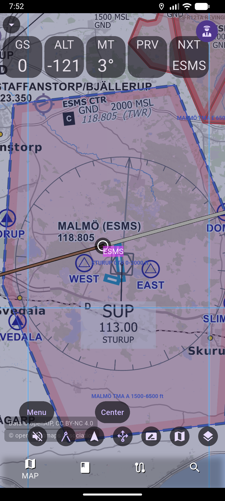
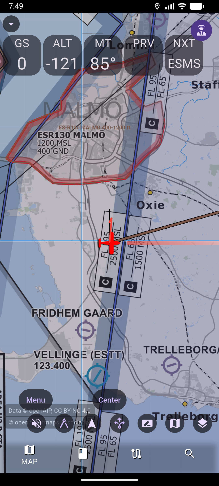
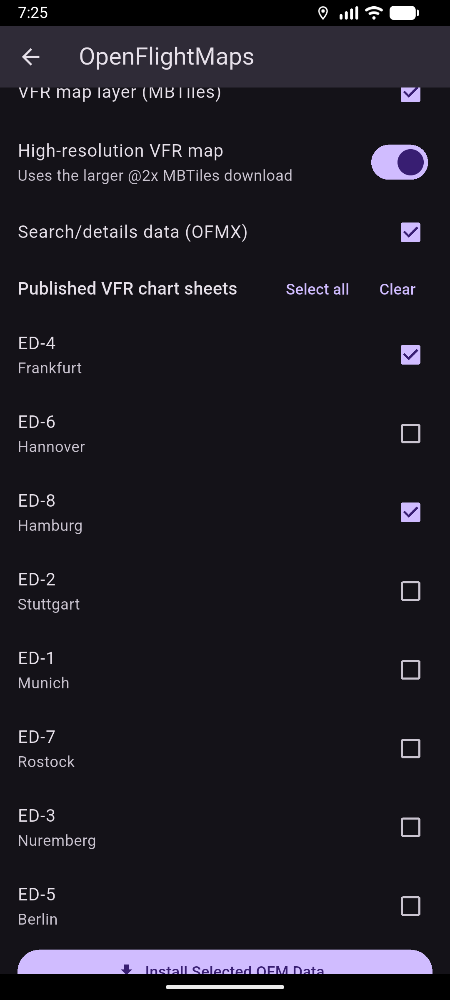
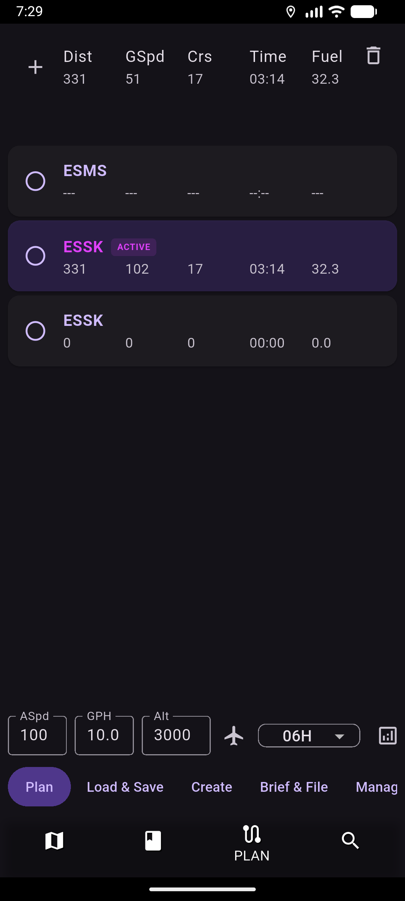

# AvareX‑EU

**A free, open‑source European electronic flight bag (EFB)** — a community fork of
[AvareX](https://github.com/apps4av/avarex) by Apps4Av, written in Flutter.

Georeferenced moving map · European VFR charts · openAIP airspace · internet ADS‑B traffic ·
animated weather radar · flight planning — on Android, iOS, Windows, macOS, Linux &amp; Raspberry Pi.

[**Website**](https://wolverine2k.github.io/avarex/eu/) ·
[**Download**](https://github.com/wolverine2k/avarex/releases) ·
[**Privacy policy**](https://wolverine2k.github.io/avarex/eu/privacy.html) ·
[**User manual**](USER_MANUAL.md)

---

## What is AvareX‑EU?

AvareX‑EU keeps AvareX's proven US, FAA‑backed workflow and adds **optional European data
providers** on top. European data is **downloaded on demand**, per region and AIRAC cycle, so the
app package stays small and works fully offline once your charts are installed.

It ships **without** the sign‑in, subscription paywall, or Firebase‑backed cloud features of the
upstream app — there are **no accounts, no analytics, no advertising, and no tracking**. Your
routes, logbook, settings, and any API keys stay on your device. See the
[privacy policy](https://wolverine2k.github.io/avarex/eu/privacy.html).

> [!WARNING]
> AvareX‑EU is **not** a certified GPS or navigation system and must not be used as a sole means of
> navigation. European data added by this fork is complementary and **not certified**. Always
> cross‑check with official sources and certified equipment.

---

## Screenshots

| European VFR moving map | Ownship &amp; airspace |
| :---: | :---: |
|  |  |
| OpenFlightMaps VFR chart of Malmö (ESMS) with TMA/CTR airspace, openAIP layers and GS/ALT/track instrument tiles. | Georeferenced ownship with restricted areas and stepped airspace, and `© openAIP` / `© open flightmaps association` attribution. |

| OpenFlightMaps data download | Flight plan &amp; nav log |
| :---: | :---: |
|  |  |
| Per‑region download of MBTiles + OFMX data, optional `@2x` high‑res tiles, and published VFR chart sheets. | Per‑leg nav log with distance, ground speed, course, time and fuel. |

---

## Features

### The EU additions

| | Provider | What it adds |
| :--: | --- | --- |
| 🗺️ | **[OpenFlightMaps](https://openflightmaps.org/)** | Primary European VFR chart tiles (georeferenced EPSG:3857 MBTiles) + OFMX airport, runway, comms, navaid, reporting‑point and airspace data. Region &amp; AIRAC‑cycle aware. |
| 🛩️ | **[openAIP](https://www.openaip.net/)** | Optional supplementary airports, navaids, VFR reporting points, airspace and obstacles via **your own** openAIP Core API key (no shared credential). |
| 📡 | **[OpenSky Network](https://opensky-network.org/)** | Optional internet ADS‑B traffic layer for situational awareness (advisory), alongside GDL90 receivers over Wi‑Fi. |
| 🌧️ | **[RainViewer](https://www.rainviewer.com/)** | Global, animated internet radar mosaic (2‑hour loop, selectable color schemes) — the default internet radar in the EU build. No key required. |
| 🌬️ | **[Open‑Meteo](https://open-meteo.com/)** | Pressure‑level winds aloft outside US FB coverage, mapped to the same altitude bands. Free by default; optional personal key. |
| 📄 | **[FlyBrief](https://flybrief.app/) + [aip.aero](https://aip.aero/)** | Per‑country georeferenced NOTAMs (offline‑capable) and link‑outs to official national AIP charts. |
| ⛰️ | **[AWS Terrain Tiles](https://registry.opendata.aws/terrain-tiles/)** | On‑device, per‑country terrain/elevation transcoding for terrain profile and GPWS anywhere. |
| 🤖 | **Flight Intelligence (BYO AI)** | Optional assistant that talks to an OpenAI‑compatible endpoint **you** configure with your own key. Off until set up. |

### Carried over from AvareX

- Georeferenced moving map with ownship, track‑up / north‑up, range / speed / glide rings.
- Movable instrument tiles (GS, ALT, track, ETA, ETE, distance, bearing, and more).
- Decoded METAR with selectable VFR/IFR threat thresholds.
- Flight planning with a per‑leg nav log.
- ADS‑B / GDL90 traffic and external GPS, NMEA / autopilot output.
- Logbook, checklists, aircraft profiles, weight &amp; balance, and notes.
- Works fully offline once charts and databases are downloaded.

---

## Getting started

### Install

Grab the latest build for your platform from the
**[GitHub releases](https://github.com/wolverine2k/avarex/releases)** page (Android APK is provided
for direct install). AvareX‑EU also builds for iOS, Windows, macOS, Linux and Raspberry Pi.

### Add European data in four steps

1. **Install a chart region** — open **Menu → Data → OpenFlightMaps**, pick a region and AIRAC
   cycle, choose VFR chart sheets, and install. Optionally enable the larger `@2x` high‑res tiles.
2. **Add openAIP (optional)** — under **Menu → Data → openAIP**, enter your personal openAIP API
   key, **Test Connection**, then download country data by ISO code (e.g. `DE`, `FR`, `SE`).
3. **Enable the layers you want** — turn on `OFM VFR Chart`, `OFM Interactive Data`, and
   `openAIP Interactive Data` in the map‑layer controls (enabled by default on fresh installs).
4. **Turn on traffic &amp; radar** — enable the internet ADS‑B traffic layer and the RainViewer
   **Radar** weather product when you want them.

> European support is suitable for **supplementary VFR situational awareness** and direct waypoint
> navigation when the required regional data is installed. It is **not** equivalent to the US
> implementation for IFR procedures, legal preflight briefing, NOTAMs, terrain clearance, or filing.

---

## European data support — details

AvareX keeps its FAA‑backed United States workflow unchanged and adds the optional European
providers below. European data is downloaded on demand rather than bundled in the application
package.

### OpenFlightMaps

[OpenFlightMaps](https://openflightmaps.org/) provides the primary European VFR chart and
aeronautical‑data integration:

- Georeferenced EPSG:3857 MBTiles for the offline moving map. Standard‑resolution tiles are the
  default; larger `@2x` archives are optional.
- OFMX airport, runway, runway‑end, communication, navaid, reporting‑point, and airspace records.
- Regional PDF VFR chart sheets for offline reference. These documents are identified as not
  GPS‑referenced and are not moving‑map layers.
- Region and AIRAC‑cycle selection, progress reporting, cancellation, replacement, and removal.
- Separate map controls for `OFM VFR Chart` and `OFM Interactive Data`.
- Source, region, cycle, attribution, and disclaimer information in search and destination details.

Only one cycle of a region should be active at a time. Missing raster tiles are transparent so
regional chart boundaries do not obscure other map content.

### openAIP

[openAIP](https://www.openaip.net/) is an optional supplementary provider for European airports,
navaids, VFR reporting points, airspace, and obstacles. AvareX uses the authenticated openAIP Core
API rather than embedding a shared project credential.

To use it:

1. Create an openAIP account and personal API client.
2. In AvareX, open **Menu → Data → openAIP**.
3. Enter the personal API key and select **Test Connection**.
4. Enter a two‑letter ISO country code, such as `SE`, `DE`, or `FR`.
5. Select **Download Country Data**.
6. Enable **openAIP Interactive Data** in the map‑layer controls when its airspace display is wanted.

Credential and data handling:

- The API key is masked and stored with platform secure storage. It is not included in source code,
  application diagnostics, downloaded data, or the APK.
- The settings screen provides Save, Test Connection, Clear Key, country download, and country
  removal actions.
- API results are paginated and cached offline in a separate `openaip.db`.
- Downloaded airports and runways participate in search, nearby‑airport lookup, runway‑length
  filtering, and destination details.
- Navaids and reporting points participate in search, nearby lookup, route‑point selection, and
  nearest‑VOR lookup.
- Obstacles augment the existing obstacle layer when a usable top elevation is available. Records
  lacking sufficient elevation information are not used for altitude filtering.
- Airspace polygons include vertical limits and `BY NOTAM`/`ON REQUEST` labels.
- All openAIP results retain source and country provenance and display openAIP attribution.

openAIP data is licensed under [CC BY‑NC 4.0](https://creativecommons.org/licenses/by-nc/4.0/). It
is community‑maintained supplementary data and must not be treated as certified or as the sole
source for primary navigation or flight planning. See the
[openAIP legal information](https://www.openaip.net/legal) and
[API documentation](https://docs.openaip.net/) before redistributing data or shipping it in a
commercial product.

### Official AIP charts (aip.aero)

For any covered European (and several nearby) airport, the destination details provide an
**Official AIP &amp; approach charts** action that opens the airport's page on
[aip.aero](https://aip.aero/) in the platform browser. aip.aero is a free index that links straight
to the country's official national AIP publication (VFR/IFR charts, aerodrome data).

- This is a link hand‑off only. AvareX does not fetch, cache, or redistribute any chart PDF or AIP
  content; it merely builds and opens the correct URL.
- The ICAO identifier is mapped to the aip.aero country entry; where the airport deep link is not
  available the country landing page is used instead.
- The action is clearly marked as an external site and reminds the pilot to verify AIRAC currency
  before every flight.

This provides a legal, low‑friction route to official plates and airport diagrams without embedding
third‑party charts. It is not a georeferenced, moving‑map plate overlay.

### Decoded METAR with selectable VFR/IFR thresholds

Airport weather panels show, below the raw METAR, a **Decoded METAR** card that translates the
report into plain English (wind, visibility, ceiling, present weather, temperature/dewpoint spread,
and pressure) and color‑codes each element by threat level. A per‑view **VFR/IFR** selector switches
the threshold profile so the same report is assessed against thresholds appropriate to the operation.

- Uses only the raw METAR AvareX already holds; no third‑party service.
- The selected profile is remembered across sessions.
- Advisory only; it is not a substitute for an official weather briefing.

### Default map layers

On a fresh installation the Europe map layers — `OFM VFR Chart`, `OFM Interactive Data`, and
`openAIP Interactive Data` — are enabled by default so installed European data is visible without
first opening the layer controls. These layers render nothing until the corresponding regional data
is installed, so United‑States‑only users are unaffected. Existing users keep their saved layer
choices; the default applies only to new installs.

### Winds aloft (Open‑Meteo)

The built‑in winds aloft come from NWS FB text products that only cover the United States and its
territories. Outside that coverage the destination Wind tab retrieves pressure‑level winds from
[Open‑Meteo](https://open-meteo.com/) and converts them into the same altitude bands (surface
through 39,000 ft) so the display is identical.

- Selection is automatic: within US FB coverage the existing product is used; beyond it (Europe and
  the rest of the world) Open‑Meteo is queried for the destination coordinate, with the US data as a
  last‑resort fallback.
- The free Open‑Meteo endpoint is used by default. A pilot who needs commercial‑compliant access can
  enter a personal Open‑Meteo API key under **Menu → Data → Open‑Meteo Winds** (Save, Test
  Connection, Clear). The key is stored in platform secure storage and never embedded in the app.
- Winds are shown with `Winds © Open-Meteo.com, CC BY 4.0` attribution. They are forecast, advisory,
  and not a substitute for an official weather briefing.

Meteostat was evaluated as an additional surface‑observation provider but is not integrated: its
JSON API requires a per‑user paid RapidAPI key and largely duplicates METAR/Open‑Meteo coverage. It
remains a possible future option for historical/station surface observations.

### NOTAMs (FlyBrief, offline)

The built‑in NOTAM source is a United States FAA API that returns nothing in Europe. Where it has no
coverage, the airport NOTAM tab falls back to [FlyBrief](https://flybrief.app/) per‑country,
georeferenced NOTAM GeoJSON (polygons with altitude bands, schedules and active‑now flags).

- Selection is automatic: the built‑in source is tried first; outside its coverage the FlyBrief
  country under the destination is used, filtered to NOTAMs near the point (active ones first).
- Offline‑first: **Menu → Data → NOTAMs (FlyBrief)** downloads and stores the current country's
  NOTAMs (and obstacles) under `{dataDir}/flybrief/` so they are available without a connection. The
  tab loads the stored file when present and only fetches live when it is missing.
- ~28 European countries are covered. NOTAMs carry
  `NOTAMs © OpenAIP contributors & national AIS via FlyBrief (CC BY-NC-SA 4.0)` attribution and are
  advisory only — always confirm against the official national briefing.

### Radar mosaic (RainViewer)

The built‑in NEXRAD radar mosaic comes from the US ADS‑B/GDL90 uplink and the Iowa Mesonet tile
service, both of which only cover the United States. The EU build replaces the internet **Radar**
product with a global, animated mosaic from [RainViewer](https://www.rainviewer.com/).

- The **Radar** weather product (enable the **Weather** map layer, then the weather‑products control)
  shows composite radar reflectivity worldwide, including Europe.
- It is animated: RainViewer publishes the past two hours of frames at 10‑minute steps, which the map
  loops through automatically. The frame slider reflects the current position in the loop.
- The color scheme is selectable. A **Radar colors** picker at the top of the weather‑products panel
  offers RainViewer's color schemes (Universal Blue, The Weather Channel, NEXRAD Level III, and
  others); the choice is remembered across sessions.
- No key and no login are required — tiles are fetched from RainViewer's free public API directly
  from the device.
- Radar carries `Radar © RainViewer.com` attribution (shown on the map and in the weather‑products
  panel). It is composite third‑party reflectivity, is advisory only, and is not an authoritative
  FAA/NWS product or a substitute for an official weather briefing.

The US builds keep the existing NEXRAD/Iowa Mesonet radar unchanged. The source is selected at build
time (`--dart-define=AVAREX_EU=false` restores the Mesonet mosaic).

### Flight Intelligence (bring‑your‑own AI provider)

The optional **Flight Intelligence** assistant is not tied to any bundled cloud account. The pilot
supplies an OpenAI‑compatible provider (base URL, optional API key, and model) under the assistant's
settings; requests go straight from the device to that endpoint. The key is stored in platform
secure storage and is never embedded in the app. Leaving it unconfigured simply disables the
feature. This build ships without the former sign‑in, subscription paywall, or Firebase‑backed cloud
features (backup/sync, community, scheduler); those have been removed rather than gated.

### Terrain, elevation and GPWS (on‑device, offline)

AvareX's terrain profile, elevation readout and GPWS are geography‑agnostic but depend on elevation
tiles that were only distributed for the US. They now work anywhere by building the tiles on the
device for a chosen country.

- **Menu → Data → Terrain (Elevation)** downloads open
  [AWS Terrain Tiles](https://registry.opendata.aws/terrain-tiles/) (public domain / permissively
  licensed DEM) and transcodes them into AvareX's exact elevation‑tile format (512×512 gray+alpha
  PNG, `elevationFt = gray * 80.4712 - 364.43`, slippy X / TMS Y) stored under
  `{dataDir}/tiles/6/{z}/{x}/{y}.png`.
- Processing is on‑device and per‑country (defaults to the country under the current GPS), so nothing
  multi‑gigabyte is bundled in the app — consistent with the small‑download philosophy. Progress is
  shown and the build can be cancelled; existing tiles are skipped so it resumes cheaply.
- Rough sizes (zoom 1‑10): small countries (Slovenia, Switzerland, Netherlands) ~15‑35 MB and a
  couple of minutes; mid countries (Germany, Spain, Italy) ~180‑290 MB; large countries (France,
  Sweden, Norway) are several hundred MB to ~1 GB and are user‑initiated with an on‑screen estimate.
- Elevation accuracy after transcoding is within one gray step (~40 ft) of the source, matching the
  precision of AvareX's own US tiles. Advisory only; not certified for terrain clearance.

Bundling all‑Europe terrain into the build package is intentionally **not** done: zoom 1‑10 for all
of Europe is multiple gigabytes, which exceeds app‑store limits and the project's small‑APK goal.
Per‑country on‑device transcoding delivers the same offline capability without shipping the data in
the binary.

### Not available in open form (documented, not faked)

Some parity items have no authoritative, machine‑readable open source and are deliberately **not**
implemented rather than approximated with fragile scrapers:

- **SID/STAR and instrument procedures**: there is no open, machine‑readable European equivalent of
  the FAA CIFP; this data is commercial/licensed.
- **Georeferenced approach plates / airport diagrams**: no uniform cross‑country open catalog.
  AvareX links out to the official national AIP via aip.aero instead (see above); it does not store
  or overlay plates.

### US ↔ Europe parity

"Partial" means the feature works with available community/open data but does not have the same
coverage, authority, or product depth as the FAA‑backed US implementation.

| Capability | United States | Europe | Parity |
| --- | --- | --- | --- |
| GPS moving map and direct‑to navigation | Full | Full | Full |
| Offline VFR raster charts | FAA chart products | OFM regional MBTiles | High |
| Offline VFR PDF sheets | FAA documents | OFM reference sheets, not georeferenced | High |
| Airport search and nearby lookup | FAA database | OFM plus openAIP | High |
| Runway dimensions and surfaces | FAA database | OFM plus openAIP | High |
| Runway‑end details and runway awareness | Full where FAA data exists | Available where source runway‑end geometry exists | Partial |
| Minimum‑runway‑length filtering | Full | OFM plus openAIP runway lengths | High |
| Airport frequencies | FAA/NASR | OFMX services plus openAIP frequencies | Partial to high |
| Navaids | FAA/NASR | OFMX plus openAIP VOR/NDB/DME/TACAN data | High for covered countries |
| VFR reporting points and fixes | FAA fixes | OFMX designated points plus openAIP reporting points | High for VFR use |
| Airways and automatic IFR routing | FAA airway graph | No dependable Europe‑wide open airway graph integrated | Low |
| SID, STAR, and instrument procedures | FAA CIFP | Not available from the integrated open sources | None |
| Approach plates and airport diagrams | FAA d‑TPP products | Link‑out to official national AIP via aip.aero (not georeferenced, not in‑app overlay) | Partial |
| Airspace display | FAA airspace/SUA | OFM and optional openAIP polygons | High for static display |
| Airspace schedules and live activation | FAA products where available | Static metadata and `BY NOTAM` flags; no live activation feed | Partial |
| METAR and TAF | Aviation Weather Center | International AWC reports where stations are covered | High |
| Decoded METAR with VFR/IFR threat coloring | Plain‑English decode with selectable profile | Same decode, geography‑independent | Full |
| Radar mosaic | US NEXRAD | Global radar mosaic via RainViewer (animated, 2h loop) | High for display |
| Winds aloft and graphical weather | US AWC/WPC products | Winds aloft from Open‑Meteo pressure‑level forecasts outside US coverage; no graphical products | Partial |
| NOTAMs and temporary restrictions | FAA‑specific services | Per‑country georeferenced NOTAMs via FlyBrief, stored for offline use | Partial |
| Terrain, elevation, and GPWS | US regional terrain packages | On‑device terrain tiles transcoded per country from open DEM; enables terrain profile + GPWS | Partial |
| Obstacles | FAA obstacle data | Supplementary openAIP obstacles with incomplete‑authority warning | Partial |
| ADS‑B/GDL90 traffic and external GPS | Geography‑independent | Geography‑independent | Full |
| NMEA/autopilot output | Geography‑independent | Geography‑independent | Full |
| Logbook, checklists, aircraft, W&amp;B, notes | Geography‑independent | Geography‑independent | Full |
| Flight‑plan filing and briefing | Leidos/1800wxbrief | No European filing/briefing provider integrated | None |

European support is suitable for supplementary VFR situational awareness and direct waypoint
navigation when the required regional data is installed. It is not equivalent to the US
implementation for IFR procedures, legal preflight briefing, NOTAMs, terrain clearance, or filing.
Pilots remain responsible for obtaining current authoritative AIP, NOTAM, weather, and procedure
information from the applicable national and European services.

### Data‑source boundaries

- FAA‑backed US behavior remains unchanged and is preferred for FAA records.
- OFM is the primary European VFR chart/OFMX source.
- openAIP supplements gaps and remains independently attributable and removable.
- Provider data is stored separately instead of being inserted into the FAA database.
- Search and nearby queries merge providers while retaining provenance.
- Neither OFM nor openAIP data is represented as certified.

---

## Building

GitHub Actions builds all store targets.

### AvareX‑EU tagged releases

Pushing any Git tag runs `.github/workflows/avarex-eu-release.yaml`. The workflow runs the Flutter
tests and analyzer, builds the Android release APK and AAB, and creates a GitHub release containing:

- `AvareX-EU-<tag>.apk`
- `AvareX-EU-<tag>-source.tar.gz`
- `AvareX-EU-<tag>-source.zip`
- `CHANGELOG-<tag>.md`

The changelist contains commits since the previous tag, is used as the GitHub release description,
and is also included inside both source archives as `CHANGELOG-RELEASE.md`. The EU APK uses the
release build configuration and is intended for direct installation from the GitHub release. The EU
build ships without Firebase or the subscription paywall, so no Firebase login, Firebase
service‑account secret, or RevenueCat key is required, and the former Firebase‑backed cloud features
are unavailable. An openAIP API key is likewise not a build secret; each user supplies and securely
stores a personal key in the application. The RainViewer radar mosaic needs no key.

### Version schemes

| Platform | Source | Example |
| --- | --- | --- |
| Microsoft | `pubspec.yaml` (last digit must be 0) | `1.0.9.0` |
| Apple | `pubspec.yaml` | `0.0.9+9` |
| Google | `pubspec.yaml` (`+9` is the package build) | `0.0.9+9` |
| Snap | `snap/snapcraft.yaml` | `0.0.9` |

---

## Website &amp; privacy

- **Site:** https://wolverine2k.github.io/avarex/eu/ (source in [`docs/eu/`](docs/eu/))
- **Privacy policy:** https://wolverine2k.github.io/avarex/eu/privacy.html — no accounts, no
  analytics, no advertising, no tracking; your data stays on your device.

## Credits &amp; license

AvareX‑EU is a community fork of [AvareX](https://github.com/apps4av/avarex) by
[Apps4Av](https://groups.google.com/g/apps4av-forum). It is not affiliated with, or endorsed by, any
aviation authority. See [`LICENSE`](LICENSE). European data belongs to its respective providers
(OpenFlightMaps, openAIP, RainViewer, OpenSky, Open‑Meteo, FlyBrief) under their own licenses and
attribution requirements.
